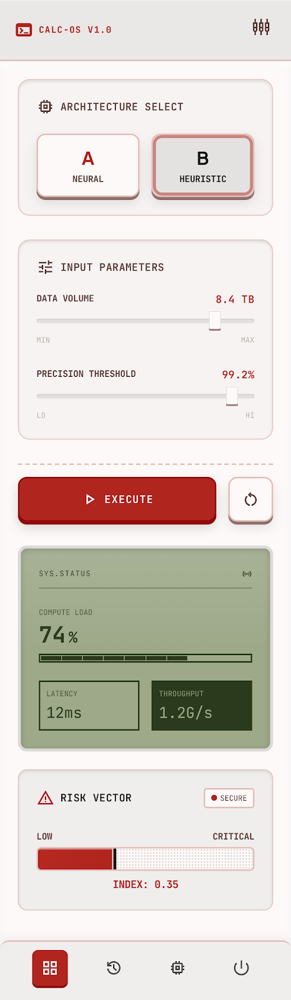

# Latency Cost Calculator (延遲成本計算器)

一個專為工程師與業務決策者設計的互動式網頁工具，用於評估、計算系統或網路延遲（Latency）對業務營收、使用者體驗及財務損失的實質影響。

## 線上展示 (Live Demo)
 [點擊此處直接體驗 Live Demo](https://github.com/gracieche/latency-cost-calculator/)

## ✨ 專案亮點與功能
- **即時營收損失評估**：輸入延遲毫秒數（ms）、每日流量及平均客單價，系統會自動轉換為潛在的财务損失。
- **模組化架構**：將前端 UI 與核心計算邏輯（`support.js`）完全分離，具備良好的可維護性。
- **專案迭代演進**：保留了從初始版本、v2 到 v3 的完整優化歷程，展現架構優化與介面重構的能力。

## 📂 技術棧與檔案結構
- **Frontend**: HTML5, CSS3, JavaScript (Vanilla JS)
- **目錄說明**:
  - `index.html`: 最新優化版 (v3) 互動介面。
  - `support.js`: 負責處理延遲成本公式的核心邏輯。
  - `/legacy-versions`: 保留的歷史版本，記錄專案演進。
  - `/assets`: 專案相關的視覺與功能截圖。

## 📸 畫面截圖


## 🛠️ 如何在本機運行
1. 將此專案複製（Clone）到本地：
```bash
   git clone [https://github.com/gracieche/latency-cost-calculator.git](https://github.com/gracieche/latency-cost-calculator.git)
